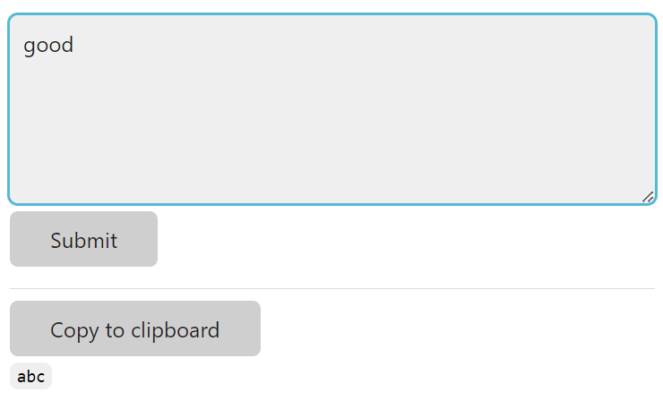

# Usage



Fill text in the text area and click "Submit".  In another device, refresh the web page to access.

# Deploy to Azure

Follow this [link](https://github.com/smartninja/example-azure-flask) to create an Azure App Service and connect to this GitHub Repository.

Update the `startup command` to `gunicorn --bind=0.0.0.0 --timeout 600 cross_device_share.app:app`

Add an environment variable called "USER" and "PASS", fill your selected user name and password.
# Setup Dev Environment

First clone this repo then change to the repo directory.

Then run following command:
```sh
pip install poetry
poetry install   # Create virtual environement, install all dependencies for the project
poetry shell     # activate the virtual environment
pre-commit install    # to ensure automatically formatting, linting, type checking and testing before every commit
```

If you want to run unit test manually, just activate virtual environment and run:
```sh
pytest
```

